# 시연 시나리오

## 메인

---

### 오늘의 트렌드

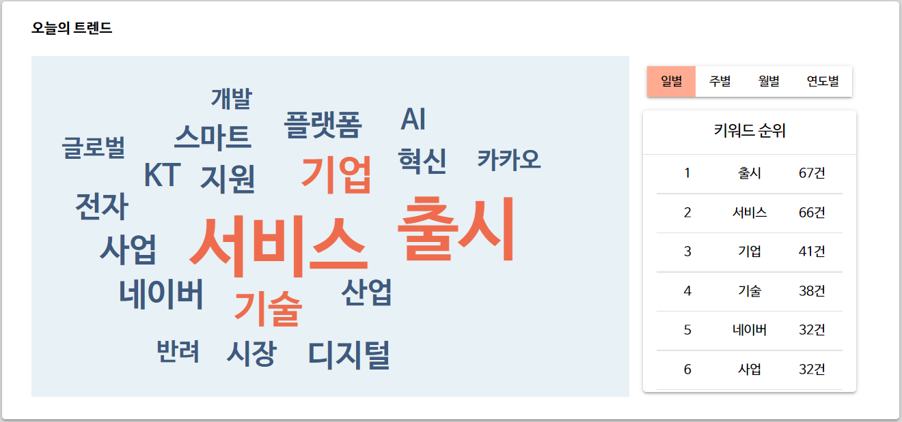

- 전일 수집한 뉴스를 분석한 결과로 워드클라우드와 통계 순위를 확인할 수 있습니다.
- 워드클라우드 내 키워드 클릭 시 해당 키워드 분석 페이지로 이동합니다.
- 기본 일별 통계를 주별, 월별, 연도별로 변경하여 금일 기준 해당 기간별 워드클라우드와 통계 순위를 확인할 수 있습니다.

### 오늘의 트렌드 뉴스

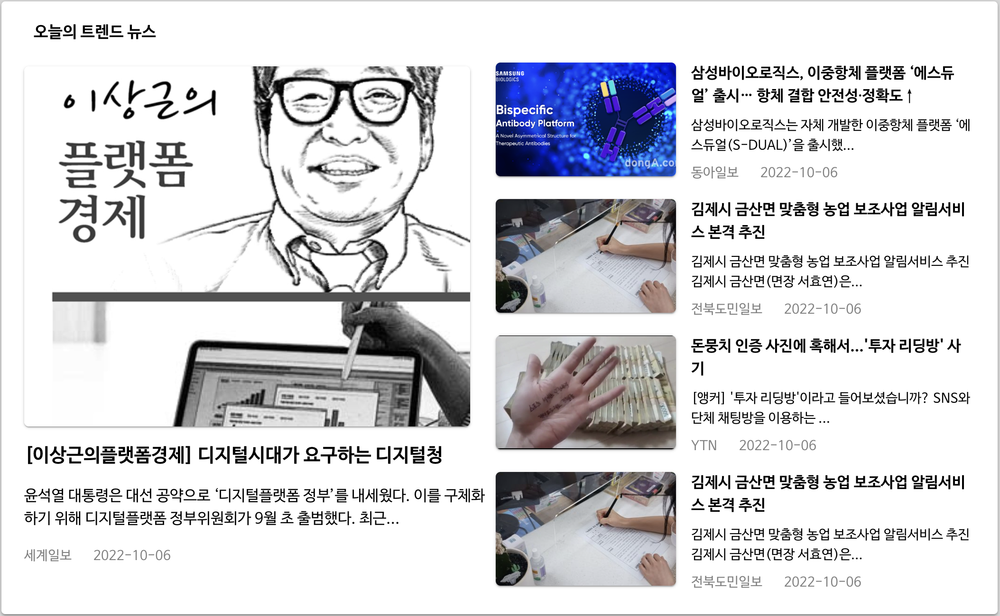

- 금일의 키워드와 연관된 최신 뉴스 기사 5개를 확인할 수 있습니다.
- 카드 클릭 시 언론사의 링크가 새 탭으로 열리며 원본 기사를 확인할 수 있습니다.

### 기간별 뉴스 분석

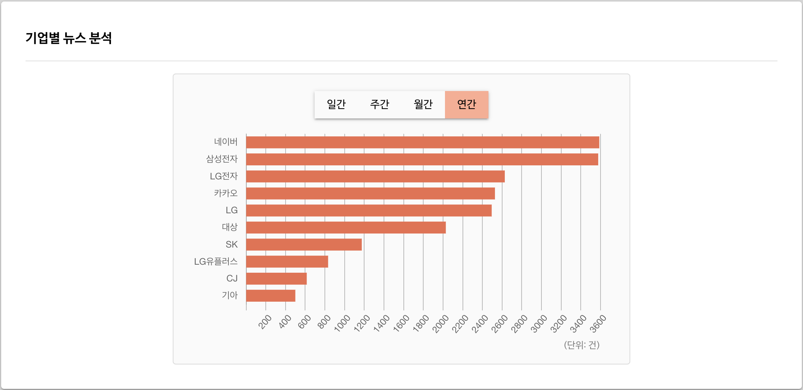

- 일간, 주간, 월간, 연도간 기업별 뉴스 분석 결과를 막대 그래프로 확인할 수 있습니다.
- 날짜는 하단의 슬라이더로 조정할 수 있습니다.

## 키워드 분석

---

### 키워드 검색

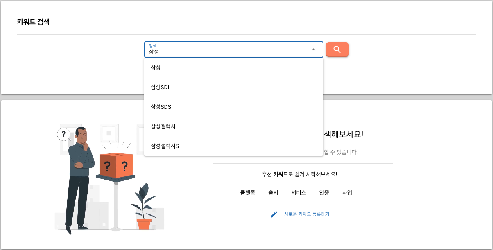

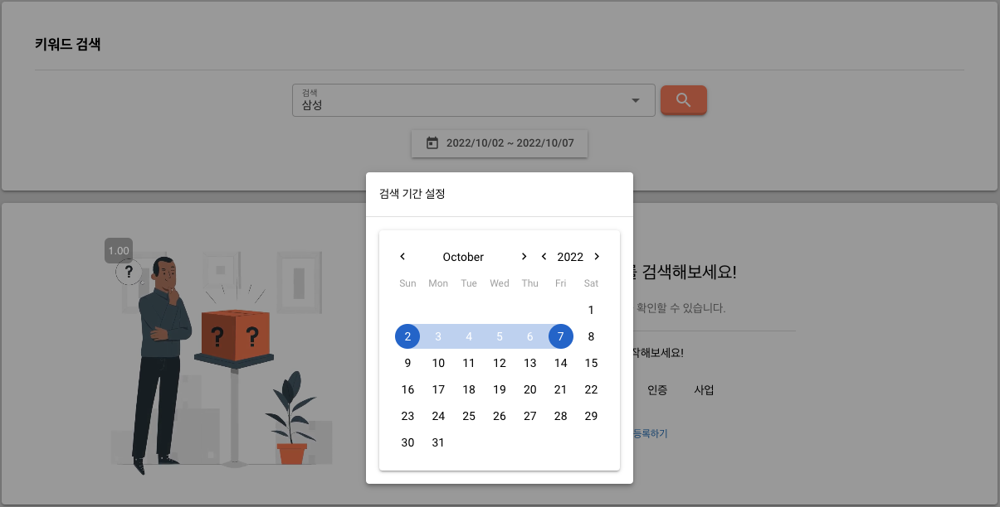

- 검색어 입력 시 자동완성된 키워드를 확인할 수 있습니다.
- 달력 형식의 인터페이스를 통해 검색 기간을 설정할 수 있습니다.

### 추천 키워드

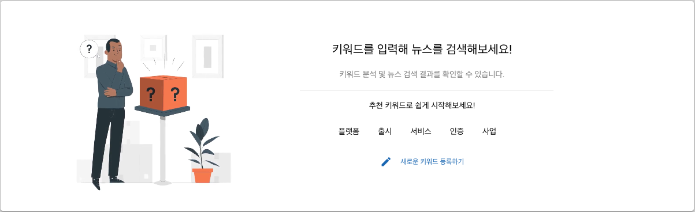

- 검색 이전의 초기 화면에서 추천 키워드를 확인할 수 있습니다.
- 추천 키워드 클릭 시 해당 키워드 분석 페이지로 이동합니다.

### 키워드 등록

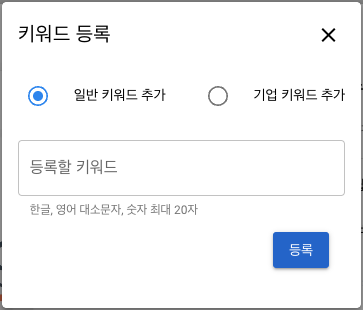

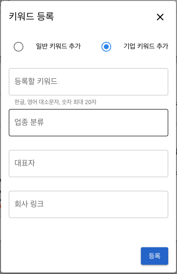

- 일반 키워드와 기업 키워드를 등록할 수 있습니다.
- 기업 키워드는 키워드(기업명), 업종 분류, 대표자, 기업 홈페이지 링크를 입력할 수 있습니다.

### 키워드 분석

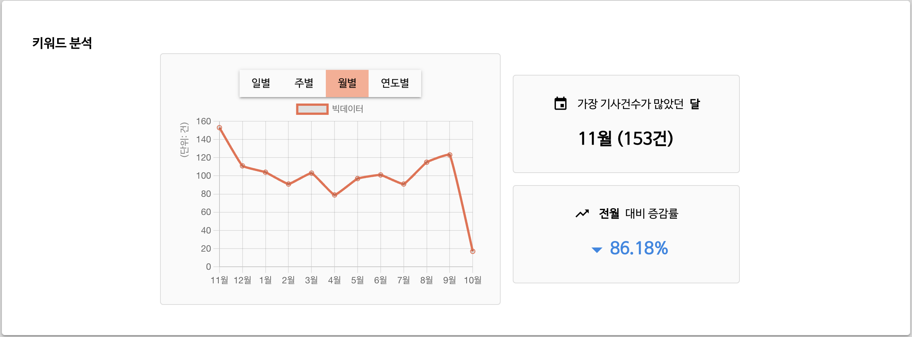

- 일별, 주별, 월별, 연도별 기사 건수를 선형 그래프로 확인할 수 있습니다.
- 가장 기사 건수가 많았던 기간과 전기간 대비 증감률 변화를 확인할 수 있습니다.

### 키워드 분석 결과

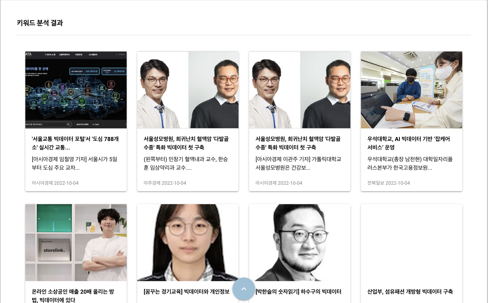

- 설정한 기간에 대한 키워드 연관 뉴스 기사 리스트를 확인할 수 있습니다.
- 카드 클릭 시 언론사의 링크가 새 탭으로 열리며 원본 기사를 확인할 수 있습니다.

### 키워드 채팅

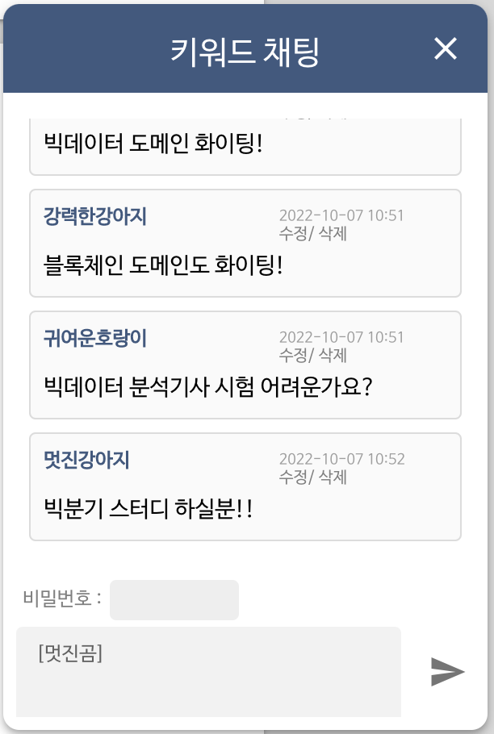

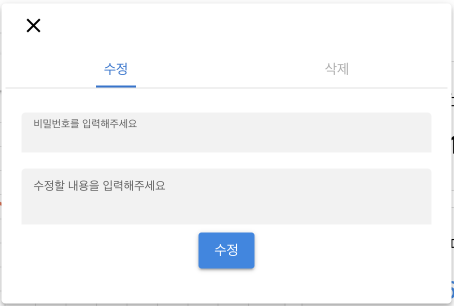

- 우하단의 채팅 버튼을 클릭 시 익명의 사용자들로부터 입력받은 키워드 채팅을 확인할 수 있습니다.
- 랜덤 닉네임이 자동으로 생성되고 비밀번호를 입력하여 채팅을 작성할 수 있습니다.
- 수정 및 삭제 기능은 생성 시 입력한 비밀번호를 확인하여 진행할 수 있습니다.

## 기업 리스트

---

### 기업 분석

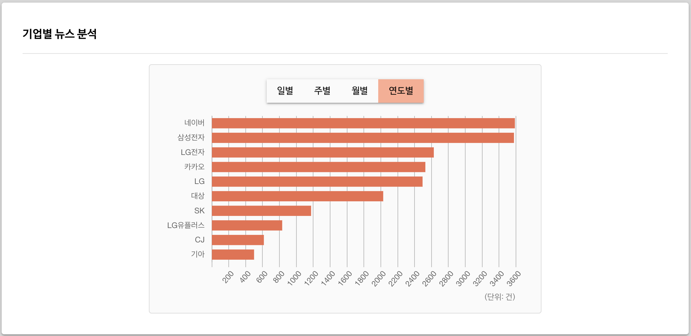

- 일별, 주별, 월별, 연도별 단위로 기업별 트렌드 순위를 막대 그래프로 확인할 수 있습니다.

### 기업 리스트 및 기업명 검색

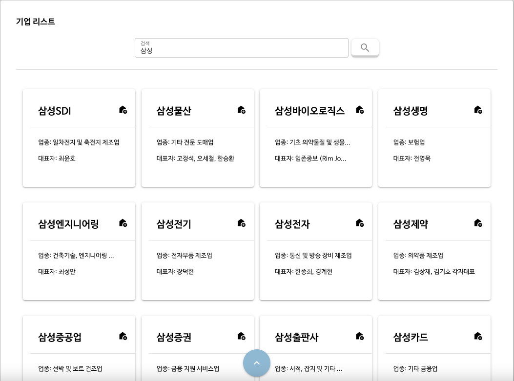

- 기업명에 관하여 포함 검색할 수 있습니다.
- 각 기업의 기업명, 업종, 대표자를 확인할 수 있고 기업 홈페이지로 이동할 수 있습니다.

## 최신 뉴스

---

### 검색 조건

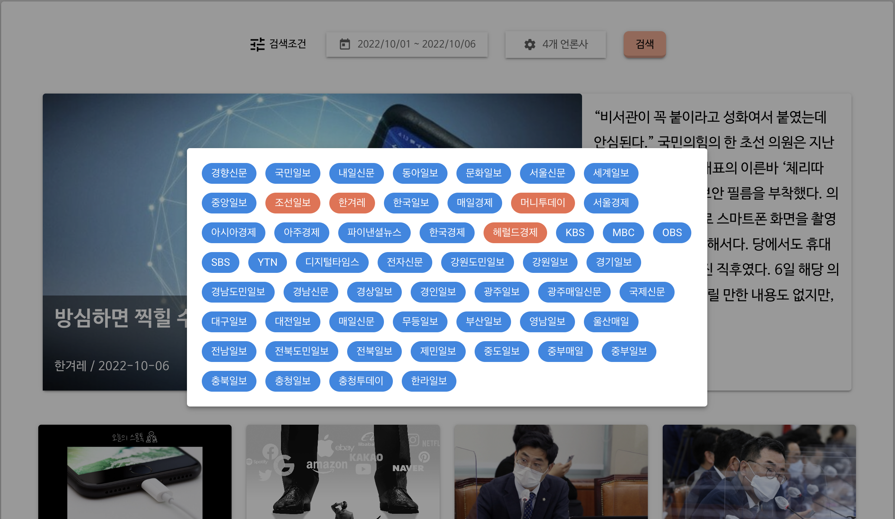

- 기간과 언론사를 설정하여 검색 결과를 필터링할 수 있습니다.
- 언론사를 선택하지 않으면 전체 언론사를 확인할 수 있습니다.

### 최신 뉴스 리스트

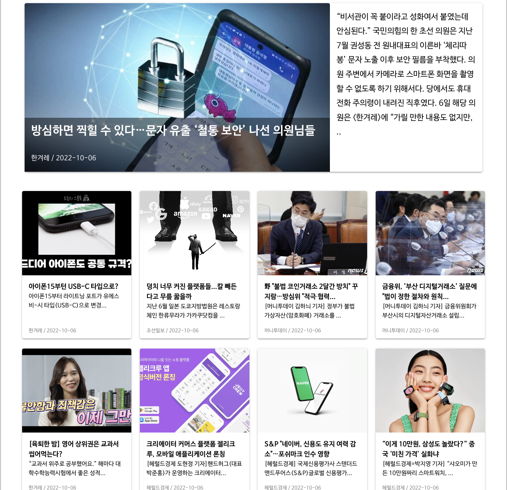

- 검색 조건에 필터링된 뉴스 기사 리스트를 확인할 수 있습니다.
- 카드 클릭 시 언론사의 링크가 새 탭으로 열리며 원본 기사를 확인할 수 있습니다.

## 서비스 소개

---

### 기획 배경

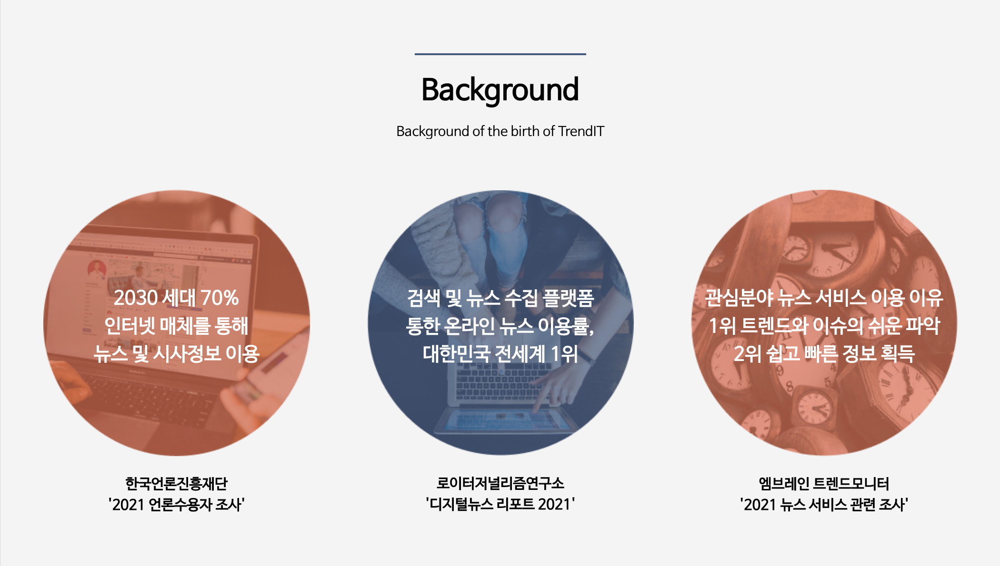

### 서비스 기능 소개

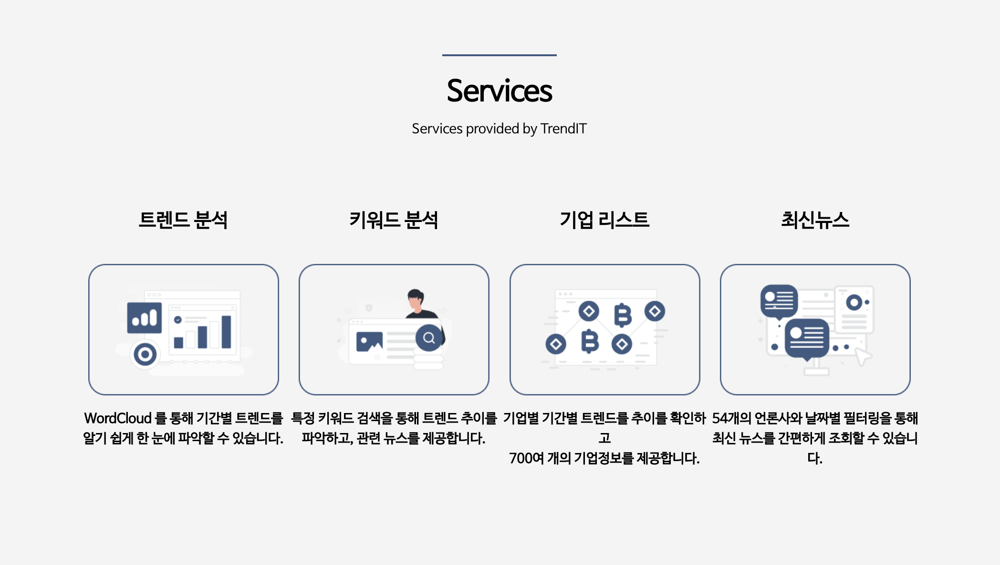

### 숫자로 보는 트렌딧

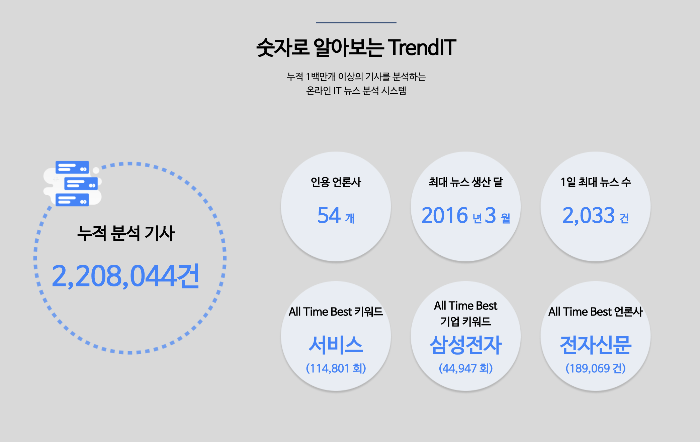

- 전체 누적 데이터 기반 특징적인 통계값을 확인할 수 있습니다.