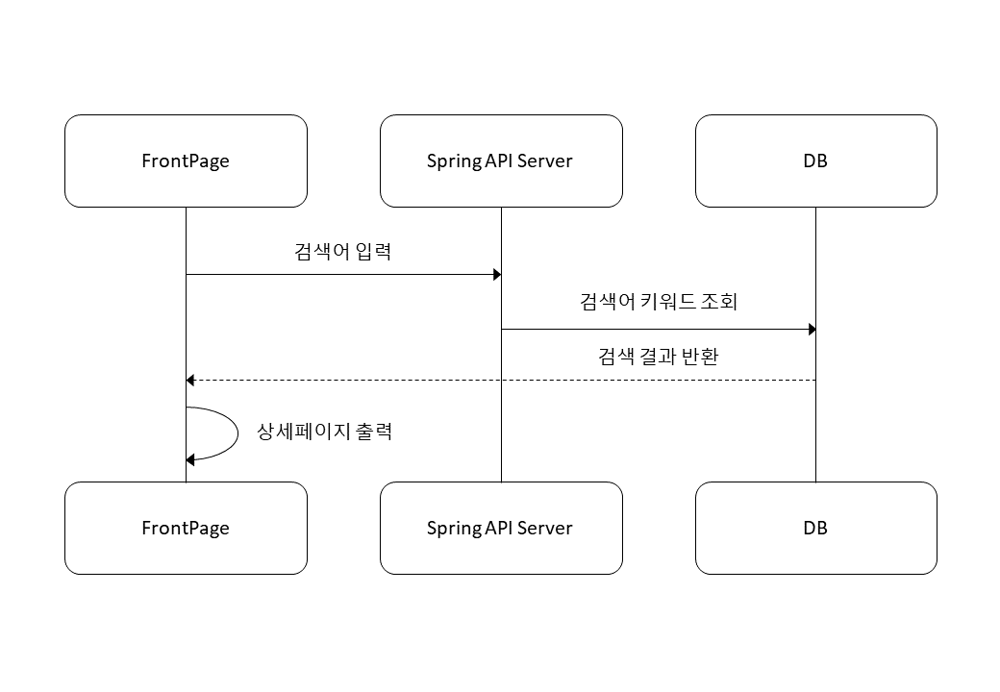
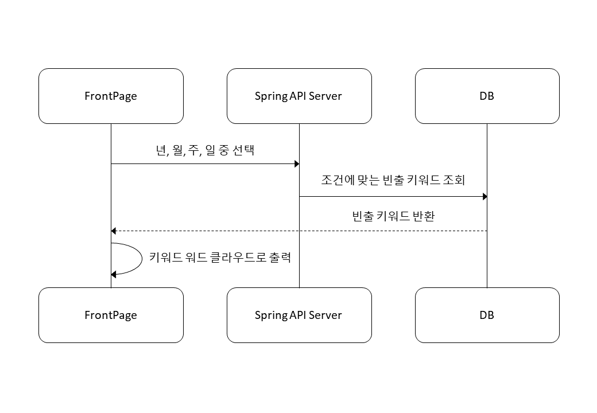
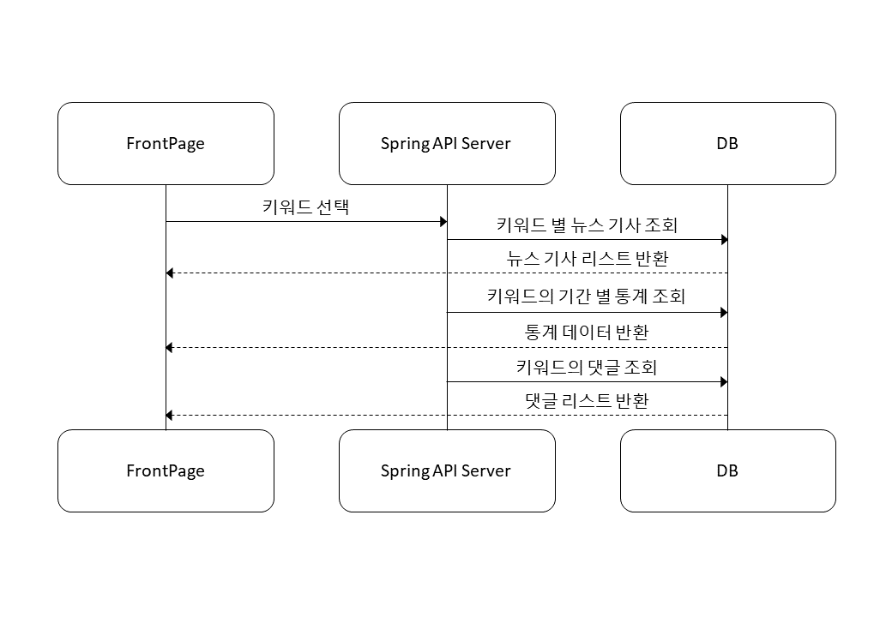
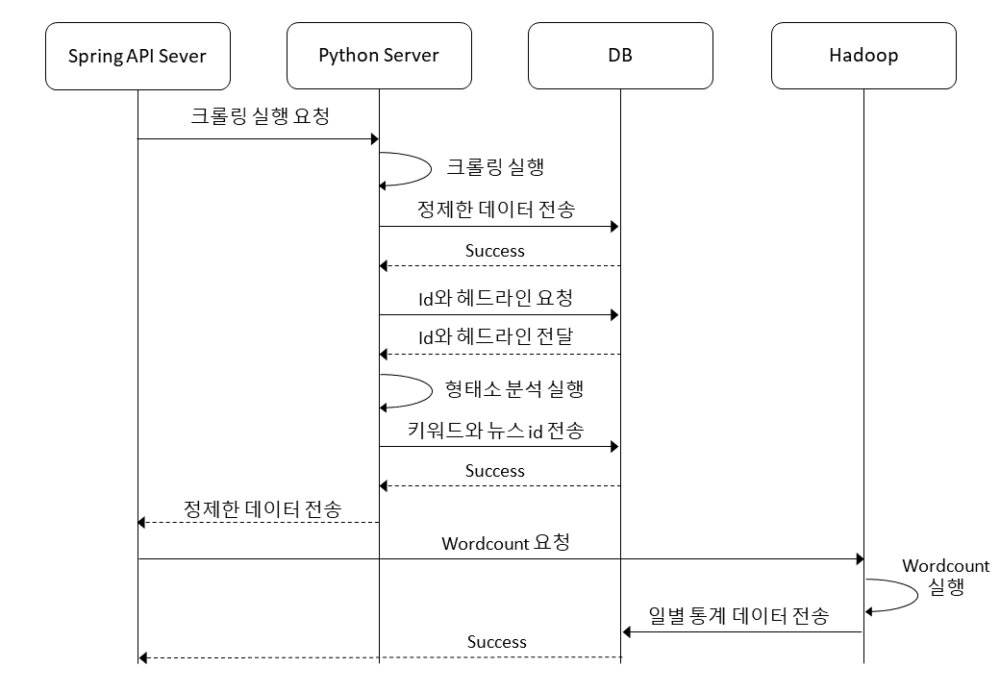

# 시퀀스 다이어그램

1. 검색
    - 검색어 데이터로 API 호출 후 상세 페이지로 이동
    
    
    
2. 트렌드 워드클라우드로 보기
    - 30개의 키워드를 기사 건수에 따라 4가지 폰트 사이즈로 배치 (200건, 100건, 50건, 20건)
    - 주기 설정
        - 오늘의 키워드 : 00시 ~ 현재 시각 직전 주기에 처리한 데이터
        - 특정 주기 단위 : 단위 시간 동안 처리한 데이터
    
    
    
3. 트렌드 순위 차트 보기
    - 막대 차트, 슬라이더
    - 일간(7), 주간(4), 월간(12), 연간(10) 기간 선택, 상위 10개 키워드
    - 다른 시점 선택 시 애니메이션으로 순위 변동 보여줌
    - 매일 새벽, 전날의 일간 키워드를 저장, 연간/월간 데이터를 가공하여 저장
    
    
    
4. 키워드 분석 페이지
    - 뉴스 기사 조회
        - 키워드가 헤드라인에 포함된 기사 리스트를 최신순 30개씩 pagination하여 가져옴
        - 총 검색 결과 건수, 기사 카드 컴퍼넌트 리스트, 페이지네이션
        - 각 기사는 썸네일, 헤드라인, 본문 일부, 언론사, 작성일, 기자 성명을 보여줌
        - 각 기사 클릭 시 해당 언론 사이트의 기사 페이지로 이동
        - [option: 정렬 조건(최신순, 관련도순), 검색 필터(기간, 언론사), 결과 내 재검색 등]
    - 기간별 통계 데이터 조회
        - 선형 차트
        - 일간(7), 주간(4), 월간(12), 연간(10) 기간 선택
        - 키워드에 해당하는 기사 건수 데이터를 활용하여 차트 보여줌
    - 키워드의 댓글 조회
        - 챗봇, 대화창 느낌의 열고 닫을 수 있는 모달
        - 만약 검색어가 키워드가 아니라면 보이지 않음
        - 아래서부터 최신순으로 100개씩 로드 (위로 스크롤 시 로드)
        - 리로드 시점에 존재하는 데이터까지만 가져옴 (이후 작성된 댓글은 리로드해야 가져옴)
    
    
    
5. 크롤링, 키워드 추출 및 워드 카운팅
    - 크롤링
        - 빅카인즈 검색 결과 크롤링하여 DB에 저장
        - 최초 : 2010년 1월 1일부터 크롤링 시점까지
        - 이후 : 이전 크롤링 시점 이후부터 현재까지
    - 키워드 추출
        - 새로 크롤링한 뉴스 기사를 형태소 분석 라이브러리와 사용자 사전을 활용하여 키워드 추출
        - 키워드의 기사 건수와 해당 기사를 RDBMS에 저장
    - Hadoop
        - 받은 데이터의 wordcount 수행
    
    