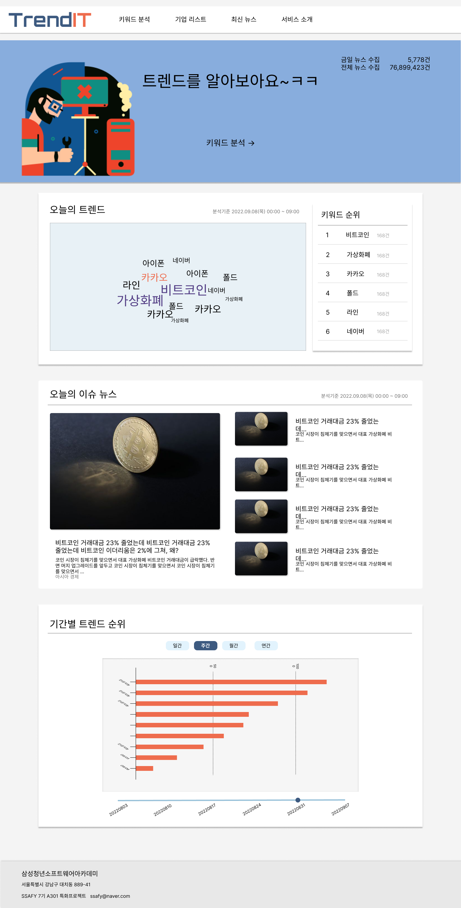
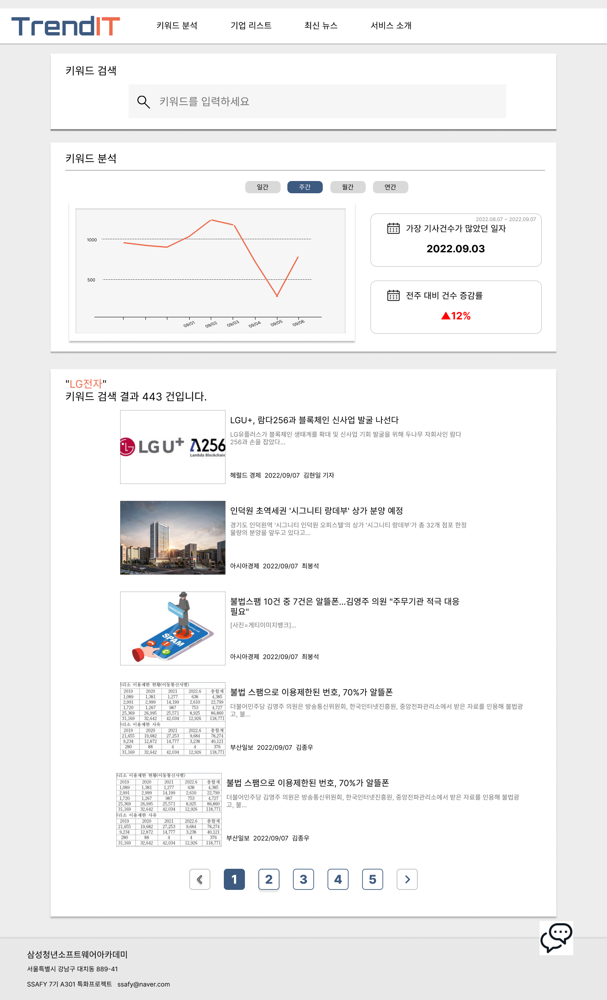
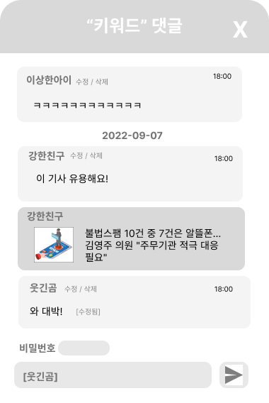
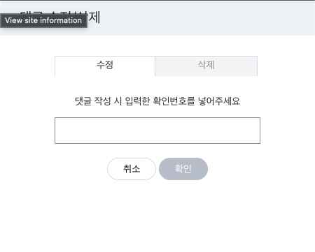
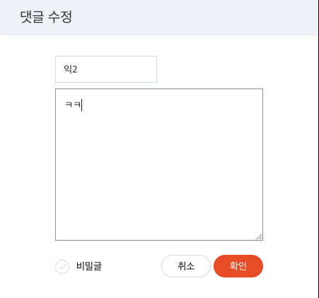
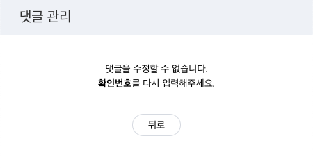
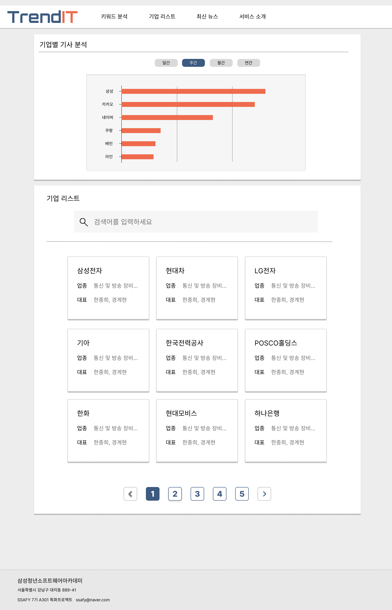
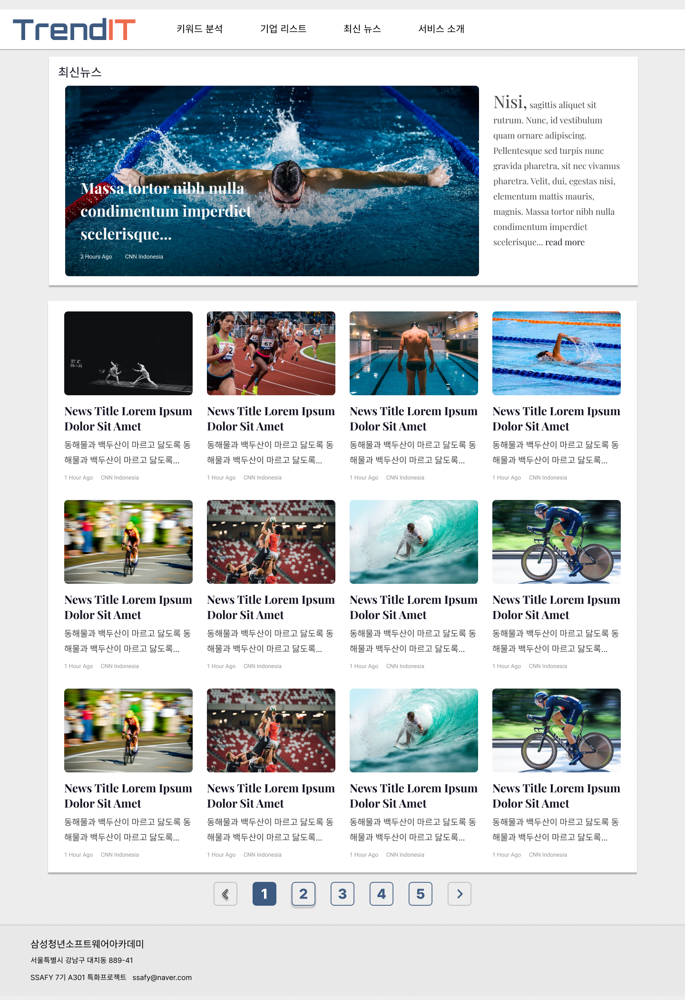

# 화면정의서, 와이어 프레임

## 화면정의서

- 페이지는 총 5개이며 각각은 공통 요소로 header bar와 footer bar를 포함한다.
- 이해를 돕기 위해, 각 화면 와이어프레임 이미지를 화면정의서에 추가합니다.

### 공통

- header
    - header bar는 좌측 로고와 우측 페이지 링크를 포함한다.
        1. 로고
        2. 링크
            1. 키워드 분석
            2. 기업 리스트
            3. 최신 뉴스
            4. 서비스 소개
- footer
    - footer bar에는 서비스 주체의 이름, 주소, 연락처 등의 간략한 정보를 표기한다.

### 메인 페이지

- 메인 배너
    - 메인 배너는 키워드 분석 페이지 링크, 금일 뉴스 수집 개수, 전체 뉴스 개수, 기타 그래픽 요소를 포함한다.
- ‘오늘의 트렌드’ 배너
    - 워드클라우드, 키워드 순위를 화면에 나타낸다.
        1. 좌측에는 오늘 기사에 많이 포함된 키워드를 기준으로 워드클라우드를 생성하여 표시한다. 워드클라우드의 요소는 클릭할 경우 해당 키워드 분석 페이지로 이동한다.
        2. 우측에는 오늘의 키워드 순위를 표시한다.
- ‘오늘의 이슈 뉴스’ 배너
    - 오늘 많이 포함된 키워드를 포함하는 뉴스의 썸네일, 헤드라인, 내용 미리보기, 링크를 표시한다.
- ‘기간별 트렌드 순위’ 배너
    - 기간별 트렌드 순위를 그래프로 화면에 표시한다.
    - 일별, 주별, 월별, 연별 순위를 선택할 수 있고 기간 단위를 선택한 후 하단 슬라이더를 이동하면 해당 일자부터 해당 단위동안 있었던 뉴스들이 포함하고 있는 키워드의 개수를 순위대로 표시한다.

### 키워드 분석 페이지

- ‘키워드 검색’ 배너
    - 검색 창이 존재하고 입력해서 검색 버튼을 클릭할 경우 해당 키워드 검색 결과를 표시한다.
- ‘키워드 분석’ 배너
    - 좌측의 그래프에서는 일별, 주별, 월별, 연별의 기간 탭을 선택하면 해당 기간단위로 해당 키워드의 언급 횟수 추이를 시간의 흐름에 따라 보여준다.
    - 우측 상단에는 해당 기간 중 가장 언급이 많았던 시기를 표시해준다.
    - 우측 하단에는 전 기간 대비 언급 증감률을 보여준다.
- ‘검색 결과’ 배너
    - 해당 키워드에 대해 검색한 결과를 최신순으로 표시한다. 이는 이미지, 링크, 헤드라인, 미리보기, 언론사 정보, 기자 정보, 날짜를 포함한다.
    - 페이지 네비게이션 바가 존재하여 검색 결과를 이동할 수 있게 한다.
- ‘댓글’ 배너
    
    
    
    - 해당 배너는 팝업형식으로 클릭 시에만 우측에 나타난다.
    - 이는 로그인하지 않은 익명 유저들이(아이디 값은 서버에서 발급받는다) 해당 키워드에 대한 의견을 간략하게 댓글 형식으로 공유할 수 있게 한다.
    - 이는 작성, 수정, 삭제가 가능하다.
        
        
        
        
        
        
        

### 기업 리스트 페이지

- 기업별 기사 분석 배너
    - 기간 탭을 선택하면 지금 시간으로부터 해당 기간 전까지의 기간 동안 해당 기업 키워드의 언급 횟수를 기반으로 내림차순인 막대 그래프로 표시한다.
- 기업 리스트 배너
    - 상단의 검색 바에서는 기업 이름으로 검색할 수 있게 한다.
    - 하단의 카드 리스트에서는 기업의 리스트가 페이지 네비게이션과 함께 출력되고 검색어가 입력되었을 경우 해당 검색 결과가 표시된다.

### 최신 뉴스 페이지

- ‘대표 뉴스’ 배너
    - 가장 최신의 (또는 정렬 기준에 따라 가장 중요하다 판단되는) 뉴스를 상단에 대표 뉴스로 큰 배너에 표시한다.
- ‘뉴스 리스트’ 배너
    - 최신 뉴스들을 카드 리스트로 표시한다. 각각의 리스트에는 썸네일, 제목, 미리보기, 작성 시간, 언론사가 표시된다. 페이지 네비게이션 바를 통해 이동할 수 있다.

### 서비스 소개 페이지

- 서비스에 대한 간략한 소개가 들어갈 예정이다.

## 와이어프레임 링크

[특화 A301 와이어프레임 링크](https://www.figma.com/file/SN1QnUxYGicP3UnYKuD7zN/%ED%8A%B9%ED%99%94-A301?node-id=0%3A1)
